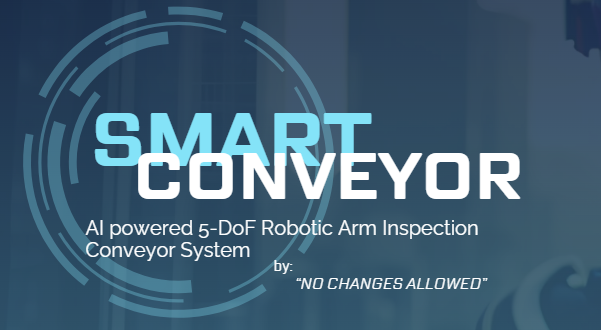

<!-- markdownlint-disable MD041 MD024 -->

<p align="center">
  
</p>
<p align="center">
  
</p>


# Smart Conveyor System

Smart Conveyor is a web-based dashboard and defect-detection system for solar-panel inspection on a conveyor belt. It combines real-time camera feeds, YOLOv8 computer vision, thermal sensor data, and generative AI reasoning to help engineers monitor quality and troubleshoot production issues.


## 🚀 Features

- **Live Inspection Feed**  
  Real-time video stream from conveyor-belt camera with MQTT-controlled robotic arm motors.  
  

- **Automated Defect Detection**  
  YOLOv8 segmentation runs on each frame to detect cracks and scratches. Results saved as JSON labels and annotated images.
  

- **Interactive Analytics Dashboard**  
  - Inspection Accuracy gauge over time  
  - Cracked-board rate with history selector (day/week/month/all time)  
  - Thermal trends: average temperature by area and distribution histograms  
  

- **Self-Inspection Training Pipeline**  
  - Accept “good” predictions into training set  
  - Retrain YOLO model via `train.py`  
  - Auto-reload best model for improved accuracy
  
  

- **Database & Product Detail Views**  
  Browse all inspected panels, view image history, thermal history, status badges, and on-demand LLM reasoning  
  

- **PDF Reporting**  
  Generate daily/weekly/monthly inspection reports with pie charts, images, and actionable recommendations using `pdf_generator.py`.

## 📦 Technology Stack

- **Backend:** Python Flask, Ultraytics YOLOv8, paho-mqtt, websockets  
- **Frontend:** Bootstrap 5, Chart.js, Flask Jinja2 templates  
- **AI Reasoning:** Google Gemini (via `google.generativeai`)  
- **Data Storage:** JSON “products.json” database, local file system for images & labels  
- **PDF Generation:** FPDF + Matplotlib

## 🛠️ Installation

### Create & activate a virtual environment

```bash
python -m venv .venv
source .venv/bin/activate      # Linux/macOS
.venv\Scripts\activate.bat     # Windows

### Install dependencies

```bash
pip install -r requirements.txt
```

### Configure environment variables

Create a `.env` file in the project root:

```env
GEMINI_API_KEY=your_google_gemini_api_key
MQTT_BROKER=broker.hivemq.com      # or your broker
MQTT_PORT=1883
```

### Prepare folders

```bash
mkdir -p static/product_images
mkdir -p static/new_images
mkdir -p static/predictions
mkdir -p trained_models
```

## ▶️ Usage

### Start the Flask app

```bash
python app.py
```

By default, the app listens on [http://127.0.0.1:5000/](http://127.0.0.1:5000/)

### Navigate

- **Home:** Overview & intro video  
- **Analytics:** Main dashboard (accuracy, cracked-rate, thermal)  
- **Livestream:** Live camera + motor controls  
- **Database:** Browse products & statuses  
- **Self-Inspection:** Upload new images for training

### Trigger Retraining

In the “Self‐Inspection” tab, accept predictions and then POST to `/train` or click “Retrain” button, which runs `train.py` and reloads the best model.

### Generate Reports

On the Analytics page, select “Daily”, “Weekly”, or “Monthly” in the PDF form and click **Generate Report**.

## 📁 Repository Structure

```bash
.
├── app.py                 # Main Flask application
├── train.py               # YOLOv8 training script
├── pdf_generator.py       # Automated PDF report generation
├── requirements.txt
├── Database/
│   └── products.json      # Inspection & thermal data storage
├── static/
│   ├── product_images/    # Per-panel image & label folders
│   ├── new_images/        # Incoming images for self-learning
│   ├── predictions/       # YOLOv8 output images
│   └── images/            # README assets: hero.png, analytics.png, etc.
├── templates/htmls/       # Jinja2 templates (home.html, analytics.html, etc.)
└── images/                # GIFs & screenshots for README
```

## 🤝 Contributing

1. Fork the repo  
2. Create a feature branch  
   ```bash
   git checkout -b feature/YourFeature
   ```
3. Commit your changes  
   ```bash
   git commit -m "Add awesome feature"
   ```
4. Push to branch  
   ```bash
   git push origin feature/YourFeature
   ```
5. Open a Pull Request!

Please adhere to code style, write tests for new functionality, and update this README as needed.

## 📄 License

This project is licensed under the [MIT License](LICENSE).

## Our Team
 
 ---
